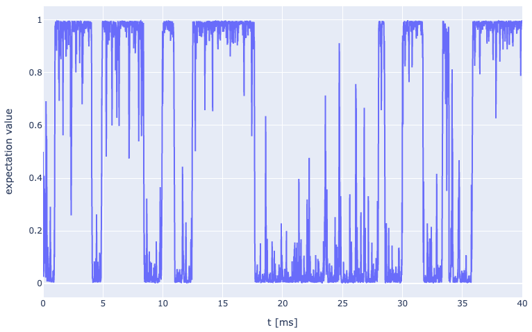

# QuantumCatch: a Python Package for the Analysis and Simulation of Quantum Measurements 
by M. Sifft and D. Hägele

The QuantumCatch package is open-source software for simulating and evaluating continuous quantum measurements via 
so-called quantum polyspectra. Here we refer to the polyspectra as second to fourth order spectra 
(powerspectrum, bispectrum, and 2D cut through trispectrum). The simulation of measurement traces 
(integration of the stochastic master equation) is implemented via the QuTiP toolbox whereas the 
calculation of polyspectra from Hamiltonians or measurements traces recorded in the lab is performed 
as described in [this paper](https://link.aps.org/doi/10.1103/PhysRevB.98.205143) and [this paper](https://arxiv.org/abs/2011.07992) which also shows the utilization of quantum 
polyspectra to extract Hamiltonian parameters from a quantum measurement.

The quantum polyspectra approach enable the characterization of very general quantum systems that may include
* Environmental damping
* Measurement backaction (Zeno effect) and arbitrary measurement strength
* Coherent quantum dynamics
* Stochastic in- and out-tunneling
* Single-photon measurements
* Additional detector noise
* Simultaneous measurement of non-commuting observables
* Incorporation of temperatures
* Completely automatic analysis of arbitrary measurement traces
* Covers all limiting case of weak spin noise measurements, strong measurements resulting in quantum jumps, and single photon sampling

[This poster](Examples/Overview_Poster.pdf) provides an overview of the quantum polyspectra approach to quantum system characterization. 
Here is a brief summary: The analysis of a continuous measurement record 𝑧(𝑡) poses a fundamental challenge in 
quantum measurement theory. Different approaches have been used in the past as records can, e.g., exhibit 
predominantly Gaussian noise, telegraph noise, or clicks at random times. This poster summarizes our latest 
findings, showing that quantum measurements from all the aforementioned cases can be analyzed in terms of higher-order 
temporal correlations of the detector output 𝑧(𝑡) and be related to the Liouvillian of the measured quantum system. 
The comparison of temporal correlations via so-called quantum polyspectra is based on expressions derived without 
approximation from the stochastic master equation [1] and automated without requiring manual post-processing of 
the detector output. This allows for fitting of system parameters such as tunneling rates in a quantum transport 
experiment [2]. The very general stochastic master equation approach includes coherent quantum dynamics, environmental
damping, and measurement backaction at arbitrary measurement strength. This enables a systematic evaluation of quantum 
measurements from the realms of conventional spin noise spectroscopy, quantum transport experiments, and ultra-weak 
measurements with stochastically arriving single photons [3,4]. [1] Hägele et al., PRB 98, 205143 (2018), 
[2] Sifft et al., PRR 3, 033123 (2021), [3] Sifft et al. PRA 107, 052203, [4] Sifft et al., arXiv:2310.10464


## Installation
QuantumCatch is available on `pip` and can be installed with 
```bash
pip install quantumcatch
```

### Installation of Arrayfire
Besides running on CPU, QuantumCatch offers GPU support for Nvidia and AMD cards. Depending on the hardware used, the
usage of a GPU is highly recommended for quantum systems with more 
than about 10 states. A comprehensive installation guide for Linux + NVidia GPU can be found [here](https://github.com/MarkusSifft/QuantumCatch/wiki/Installation-Guide). 
For GPU calculations the high performance library Arrayfire is used. The Python wrapper ([see here](https://github.com/arrayfire/arrayfire-python)) 
is automatically installed when installing SignalSnap, however, [ArrayFire C/C++ libraries](https://arrayfire.com/download) need to be installed separately. 
Instructions can be found can be found [here](https://github.com/arrayfire/arrayfire-python) and [here](https://arrayfire.org/docs/installing.htm#gsc.tab=0).

## Documentation
The documentation of the package can be found [here](https://markussifft.github.io/QuantumCatch/). 
The package is divided into two parts: the **simulation** module and the **fitting-tools** module. 
### Simulation Module
The Simulation Module allows for the integration of the Stochastic Master Equation via the QuTip library. This way
an example measurement trace can be created. Moreover, it allows for the calculation of the theoretical quantum 
polyspectra directly from the system Liouvillian.
### Fitting-Tools Module
The Fitting-Tools Module enables a user-friendly characterization of a quantum system in the lab based on the 
quantum polyspectra of an experimental continuous quantum measurement. These quantum polyspectra can be calculated
via our [SignalSnap](https://github.com/MarkusSifft/SignalSnap) package. After providing a model Liouvillian with
one or more variable parameters, these parameters are estimated by fitting the theoretical model prediction of the 
polyspectra to their measured counterparts.

### Example: Continuous Measurement of a Qunatum Dot's Occupation
Here we are demonstrating how to simulate a simple quantum point 
contact measurement of the charge state of a quantum dot. First we have to 
import the QuantumCatch package. We will also import QuTip and NumPy.
The analysis and generation module are imported automatically.

```python
import quantumcatch as qc
import numpy as np
from qutip import *
```

Next, we are going to define the quantum dot system. The system has a Hamiltonian 
of $\mathcal{H} = 0$. The tunneling of electrons into and from the quantum dot 
and the measurement are modelled via Lindbladian damping terms 
while the measurement gets an additional backaction as defined in the 
stochastic master equation:


Let's see how this system is implemented for QuantumCatch using QuTip functions. First we are going to
define the operators:

```python
dot_levels = 2
a = destroy(dot_levels)
n = a.dag() * a
rho_0 = ket2dm(basis(dot_levels, 0)) + ket2dm(basis(dot_levels, 1)) 
rho_0 /= np.trace(rho_0)
H = 0 * n
```

Then we are going to define the initial density matrix of the quantum dot. Here we are starting in a superposition of 
full and empty:

```python
rho_0 = ket2dm(basis(dot_levels, 0)) + ket2dm(basis(dot_levels, 1)) 
rho_0 /= np.trace(rho_0)
```

By defining the tunneling rate and measurement strength we are also setting the units of time. Here we are choosing
ms so the rates will be given in kHz. 

```python
beta = 5  # in sqrt(kHz)
gamma_out = 0.5  # in kHz
gamma_in = 0.5  # in kHz
```

Now we have to add damping (c_ops) and measurement terms (sc_ops). We begin by defining the damping/measurement strength
$\gamma$ and $\beta$ choosing the name of the corresponding operator as key an the dictionary:

```python
c_measure_strength = {
    'a': gamma_out**0.5,
    'a_d': gamma_in**0.5,
}

sc_measure_strength = {
    'n': beta
}
```

Afterward we define the damping and measurement operator in QuTiP fashion:

```python
c_ops = {
    'a': a,
    'a_d': a.dag(),
}

sc_ops =  {
    'n': n,
}
```

For the calculation of the observable, we are also defining the operators with which the expectation 
values are calculated:

```python
e_ops = {
    'n': n,
}
```
The System is now ready to be initialized as follows:
```python
system = qc.System(H, rho_0, c_ops, sc_ops, e_ops, c_measure_strength, sc_measure_strength)
```

To run the simulation we simply have to define the desired time steps. Note that especially during a 
strong measurement narrow time steps should be chosen. The calc_trnasient function has many options. Please refer to 
the [docs](https://markussifft.github.io/QuantumCatch/). 

```python
t_start = 0
t_stop = int(4e1)
n_steps = int(10e3)
t = np.linspace(t_start, t_stop, n_steps)
res = system.calc_transient(t, seed=None, _solver='milstein', _normalize=False)
```
The result can be visualized by providing a list of view operators as follows:

```python
view_ops = {'n':1}
system.plot_transient(view_ops)
```


The corresponding quantum polyspectra can be calculated easily via `calculate_spectrum` function. Refer to the 
documentation for the option of this function. For example, here the usage of the GPU can be enabled setting `enable_gpu=True`.

```python
f_start = 0
f_stop = 2
n_points = 200
fs = np.linspace(f_start, f_stop, n_points)

measure_op = 'n'

spec = system.calculate_spectrum(fs, order_in=[1,2,3,4], measure_op=measure_op)
```

The polyspectra can be plotted with the `plot` method:

```python
fig = system.plot()
```


### Example: From Quantum Polyspectra to the Model Liouvillian

We begin with formulating a model quantum system using standard QuTiP functions.

```python
import quantumcatch as qc
import numpy as np
from qutip import *
```

The system has to by defined as a function (here `set_system`) that takes in an array of variable 
parameters. We will define the parameters soon, here you simply use the ´params´ dictionary 
with you own keys of choice (here `gamma_in`, `gamma_out`, and `beta`). These parameters will
be determined by the fitting routine.

```python
def set_system(params):
    # ------ Operators and Hamiltonian -----
    dot_levels = 2
    a = destroy(dot_levels)
    n = a.dag() * a
    rho_0 = ket2dm(basis(dot_levels, 0)) + ket2dm(basis(dot_levels, 1)) 
    rho_0 /= np.trace(rho_0)
    H = 0 * n
    
    # ------ System Parameters ------
    c_measure_strength = {
        'a': params['gamma_out']**0.5,
        'a_d': params['gamma_in']**0.5,
    }
    
    sc_measure_strength = {
        'n': params['beta']
    }
    
    c_ops = {
        'a': a,
        'a_d': a.dag(),
    }
    
    sc_ops =  {
        'n': n,
    }
    
    e_ops = {
        'n': n,
    }

    system = qc.System(H, rho_0, c_ops, sc_ops, e_ops, c_measure_strength, sc_measure_strength)
    
    return system, sc_ops, sc_measure_strength
```

With this parameterize system and the name of our measurement operator, we now create a fit object:

```python
m_op = 'n'
system_fit = qc.FitSystem(set_system, m_op)
```

Now, we can define the parameters with their starting values and bounds in lmfit fashion.
Assuming that the path leads to spectra calculated and saved with the SignalSnap library,
the fit routine is started with the `complete_fit` function. Refer to the documentation 
for all possible function parameters.

```python
parameter = {'gamma_in':[300, 0, 1e5, True],
             'gamma_out': [700, 0, 1e5, True],
             'beta': [1, 0, 1e12, True],
             'c': [0, -1e12, 1e12, True]}
       
path = 'example_data/polyspectra_for_fit_example.pkl'         
out = system_fit.complete_fit(path, parameter, method='least_squares', xtol=1e-8, ftol=1e-8, fit_modus='resolution_based',
                                                            fit_orders=(1,2,3,4))
```


This figure presents a comprehensive set of nine plots designed to evaluate the quality of the fit. The plots are arranged in a 3x3 grid and are interpreted as follows:

- (0,0): Depicts the first-order spectrum, S1, which is proportional to the mean of the measurement. The experimental S1 trace is displayed in blue, accompanied by its 3σ (three standard deviations) error. The fitted S1 is overlaid in orange.

- (0,1): Illustrates both the experimental and theoretical power spectra.

- (0,2): Presents the relative error between the experimental and theoretical power spectra, normalized to the experimental power spectrum, as a blue line. This line can be compared to the 3σ error of the power spectra values.

- (1,0): Displays the theoretical (upper left triangle) and experimental (lower right triangle) bispectra. This combined representation is facilitated by the symmetry properties of the bispectrum, with the diagonal serving as a symmetry axis.

- (1,1): Shows the relative error between the experimental and theoretical bispectra, normalized to the experimental bispectrum. A pixel is colored green when the difference between the experimental and theoretical bispectra is less than the 3σ error of the spectral values.

- (1,2): Features experimental and theoretical bispectral values along the axes (ω1, 0) and the diagonal, accompanied by a 3σ error band.

- (2,0) to (2,2): These plots mirror the type of plots shown for the bispectrum, but now with the trispectrum. 

Each plot provides a unique perspective on the data, collectively offering a robust assessment of the fit's accuracy.


## Support
The development of the QunatumCatch package is supported by the working group Spectroscopy of Condensed Matter 
of the Faculty of Physics and Astronomy at the Ruhr University Bochum.

## Dependencies
For the package multiple libraries are used for the numerics and displaying the results:
* Numpy
* Matplotlib
* H5py
* ArrayFire
* Numba
* SciPy
* Tqdm
* Plotly
* Psutil
* Cachetools
* Signalsnap
* Pandas
* Lmfit
* IPyWidgets

